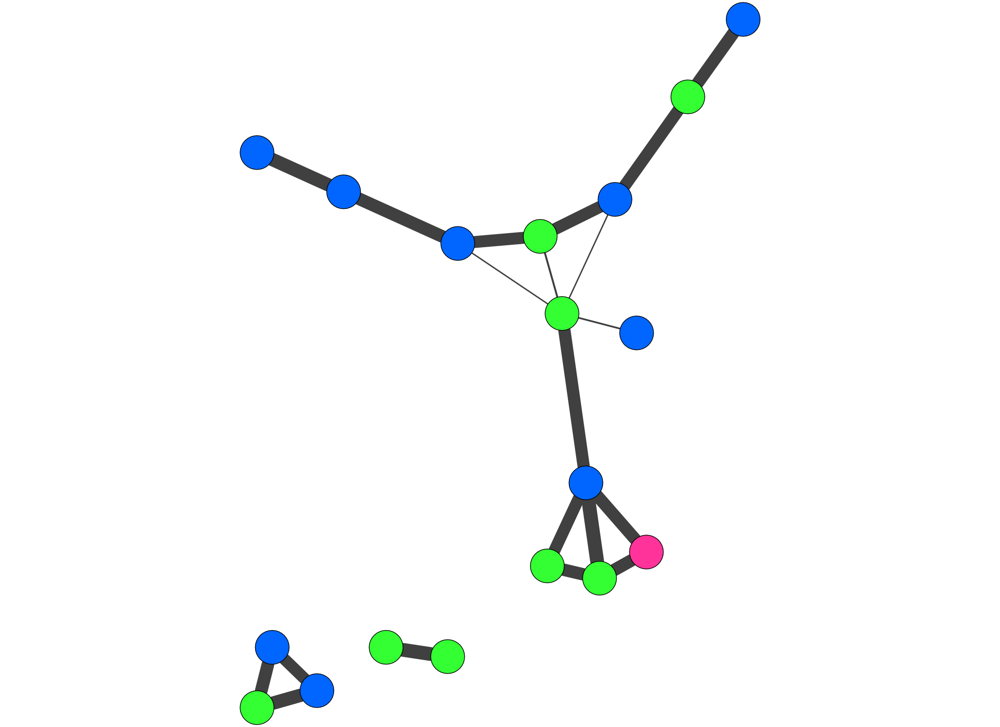

# Installation

See [Install.md](./Install.md)

Any woes?

Make sure Cytoscape is open while running these commands in R!

# Make simple network in R

Load necessary packages for the tutorial. 
```{r, message=FALSE}
library(vegan)
library(Hmisc)
library(reshape2)
library(dplyr)
library(igraph)
library(RJSONIO)
library(httr)
library(RColorBrewer)
```

Load dataset for use today
```{r}
data(dune)
dune
```

Make correlation network from vegan's dune dataset. How correlated are these different species across all these different sites? We will get a matrix will correlation values and we will visualize this as a network in Cytoscape. 

```{r}
dune_cor <- rcorr(as.matrix(dune),
                  type="spearman") 

correlations <- dune_cor$r
p_values <- dune_cor$P

## get rid of the upper section by turning to NA. 
correlations[upper.tri(correlations )] <- NA
p_values[upper.tri(p_values)] <- NA

melted_cor <- melt(correlations)
melted_p <- melt(p_values)

melted_together <- cbind(melted_p$value,
                         melted_cor)

melted_together <- na.omit(melted_together) ## gets rid of the leftover diagonals
names(melted_together)
names(melted_together)[1] <- "p_value"
names(melted_together)[4] <- "weight"
```

Want to keep only the strong correlations for visualization in our network.
```{r}
#filter for correlation above 0.6 and p-value less than 0.01
filtered_data <- filter(melted_together,
                        p_value <= 0.01  & abs(weight) > 0.6)

filtered_data <- subset(filtered_data,
                        select=c(Var1,
                                 Var2,
                                 weight))
filtered_data 
```


Make a network from the dataframe using igraph.
```{r}
graph_dune <- graph.data.frame(filtered_data,
                          directed=FALSE)
```


We can quickly visualize the network using igraph.
```{r}
plot(graph_dune)
```


# What is REST? 

- REST: representational state transfer
- uses http ports to send and receive data
- helpful websites: http://www.pgbovine.net/rest-web-api-basics.htm
- uses verbs used in http to receive and send data
- verbs we will use today are:
    - GET - read/retrieve the resource
    - POST - send/create the resource
    - PUT - update the resource
    - DELETE - deletes specified resource

We will be using [cyREST](https://github.com/idekerlab/cyREST/wiki) today to send and receive data from R to Cytoscape. 


# Setting up R to send data to Cytoscape

```{r}
source("./cyrest_cytoscape_functions.R")

## The port number can be customized in cytoscape if desired. Would need to use Cytoscape
## Preference Editor (Edit <- Preferences) and modify "rest.port" to your desired port. 
port.number = 1234

resetCytoscapeSession(port.number) # just to make sure you are using a clean Cytoscape
## removes all previous networks that were loaded in that session.

base.url = paste("http://localhost:",
                 toString(port.number),
                 "/v1", sep="")
base.url

version.url = paste(base.url,
                    "version",
                    sep="/")

cytoscape.version = GET(version.url)

cy.version = fromJSON(rawToChar(cytoscape.version$content))
cy.version

```


# Send network to Cytoscape

```{r}
cygraph <- toCytoscape(graph_dune) ## formats an igraph object to json for sending to Cytoscape

network.url <-  paste(base.url,
                      "networks",
                      sep="/")

res <- POST(url=network.url,
            body=cygraph,
            encode="json")
```


# Check out network in Cytoscape


The network will appear in Cytoscape. It will not have any fancy styles and might actually just look like one square since all of the nodes will be on top of each other. Play around with the network in Cytoscape for a few minutes and look at the Node Table, the Edge Table and the Style panel. 

To do by hand what we will automate you could do something like Style <- Edge <- Width <- weight <- "Continuous mapping" (and can then click on "Create Legend" to get a legend that maps to the style you have created.)

# Show how this style info is sent to Cytoscape via the REST API

```{r}
## look at default
default.style.url = paste(base.url,
                          "styles/default",
                          sep="/")
GET(url=default.style.url) ## shows a snippet of the json
default.style.url
```

Navigate to this URL using your web browser. 

```{r}
# Extract SUID of the new network
network.suid <-  unname(fromJSON(rawToChar(res$content)))
network.suid

# Apply a style
style.name <-  "MyFirstStyle"
apply.style.url <-  paste(base.url,
                          "apply/styles",
                          style.name,
                          toString(network.suid),
                          sep="/")
# Edge Line Size Mapping
min.weight <-  min(edge.attributes(graph_dune)$weight)
max.weight <-  max(edge.attributes(graph_dune)$weight)

point1 <-  list(
  value = min.weight,
  lesser = "2.0",
  equal = "2.0",
  greater = "2.0"
)

point2 <-  list(
  value = max.weight,
  lesser = "20.0",
  equal = "20.0",
  greater = "20.0"
)

edge.width.continuous.points <- list(point1,
                                     point2)

edge.width <- list(
  mappingType="continuous",
  mappingColumn="weight",
  mappingColumnType="Double",
  visualProperty="EDGE_WIDTH",
  points = edge.width.continuous.points
)

mappings <- list(edge.width)

style <- list(title=style.name,
              mappings = mappings)

style.JSON <- toJSON(style)

style.url <-  paste(base.url,
                    "styles",
                    sep="/")

## sends the style to cytoscape. Available to apply to network
POST(url = style.url,
     body = style.JSON,
     encode = "json")

apply.style.url <-  paste(base.url,
                          "apply/styles",
                          style.name,
                          toString(network.suid),
                          sep="/")

## applies the style to the network
GET(apply.style.url)

```

# Add the metadata to the network in R

```{r}
data(dune.taxon)

## add the taxonomic information to the graph

V(graph_dune)$Genus <- dune.taxon$Genus[match(V(graph_dune)$name,
                                         row.names(dune.taxon))]

V(graph_dune)$Family <- dune.taxon$Family[match(V(graph_dune)$name,
                                           row.names(dune.taxon))]

V(graph_dune)$Order <- dune.taxon$Order[match(V(graph_dune)$name,
                                         row.names(dune.taxon))]

V(graph_dune)$Subclass <- dune.taxon$Subclass[match(V(graph_dune)$name,
                                               row.names(dune.taxon))]

V(graph_dune)$Class <- dune.taxon$Class[match(V(graph_dune)$name,
                                         row.names(dune.taxon))]

## We can also, for example, add the degree of each vertex to the graph
V(graph_dune)$degree <- degree(graph_dune)


```


# Send network to cytoscape again

```{r}
resetCytoscapeSession(port.number)
cygraph <- toCytoscape(graph_dune)
network.url <-  paste(base.url,
                      "networks",
                      sep="/")
res <- POST(url=network.url,
            body=cygraph,
            encode="json")

## each time you send a new network to cytoscape you need to do this
network.suid <-  unname(fromJSON(rawToChar(res$content)))
network.suid

# Apply force-directed layout
layout.params = list(
  name="unweighted",
  value=TRUE
)

apply.layout.url = paste(base.url,
                         "apply/layouts/kamada-kawai",
                         toString(network.suid),
                         sep="/")
GET(apply.layout.url)

```

# Send style info to cytoscape

Node fill colour

Column <- "Class" <- Mapping Type = "Discrete Mapping"

```{r}

# Extract SUID of the new network
network.suid <-  unname(fromJSON(rawToChar(res$content)))
network.suid

# Apply a style
style.name <-  "new_style"
apply.style.url <-  paste(base.url,
                          "apply/styles",
                          style.name,
                          toString(network.suid),
                          sep="/")
#GET(apply.style.url)


## Could assign each Class a specific colour like this:

class.mappings <-  list()
class.mappings[[1]] <- list(key = "Monocots", value = "#33FF33")
class.mappings[[2]] <- list(key = "Bryophytes", value = "#FF3399")
class.mappings[[3]] <- list(key = "Dicots", value = "#0066FF")

node.colour <- list(
  mappingType="discrete",
  mappingColumn="Class",
  mappingColumnType="String",
  visualProperty="NODE_FILL_COLOR",
  map = class.mappings
)

mappings <- list(edge.width,
                 node.colour)

style <- list(title=style.name,
              mappings = mappings)

style.JSON <- toJSON(style)

style.url <-  paste(base.url,
                    "styles",
                    sep="/")
POST(url = style.url,
     body = style.JSON,
     encode = "json")

apply.style.url <-  paste(base.url,
                          "apply/styles",
                          style.name,
                          toString(network.suid),
                          sep="/")
GET(apply.style.url)

```

## Or could use RColorBrewer to automate it:

```{r}

unique_class_dune <- unique(dune.taxon$Class)

colour_class <- brewer.pal(length(unique_class_dune), "Accent")

class.mappings = list()

for (class in seq_along(unique_class_dune)){
  class.mappings[[class]] <- list(key = unique_class_dune[class], 
                                  value = unname(colour_class[class]))
}

node_colour_style = list(
  mappingType="discrete",
  mappingColumn="Class",
  mappingColumnType="String",
  visualProperty="NODE_FILL_COLOR",
  map = class.mappings
)

mappings = list(node_colour_style
)
```


# How can you use this to automate some of your analysis


## Save images from cytoscape

This will save your current network in Cytoscape as a png or a pdf. 
```{r}
network.image.url <-  paste(
  base.url,
  "networks",
  toString(network.suid),
  "views/first.png?h=1500",
  sep="/"
)

network.image.url

network.image.url_pdf <-  paste(
  base.url,
  "networks",
  toString(network.suid),
  "views/first.pdf",
  sep="/"
)
network.image.url_pdf

download.file(network.image.url_pdf, "./figures/testing_out_cytoscape.pdf")
download.file(network.image.url, "./figures/testing_out_cytoscape.png")

```



You can also save these sessions (if you want to come back to them or maybe you need to run some more complex exploratory analysis on them later)

```{r, results="hide"}
saveCytoscapeSession(filepath="./figures/networks_dune_cor.cys")
```

